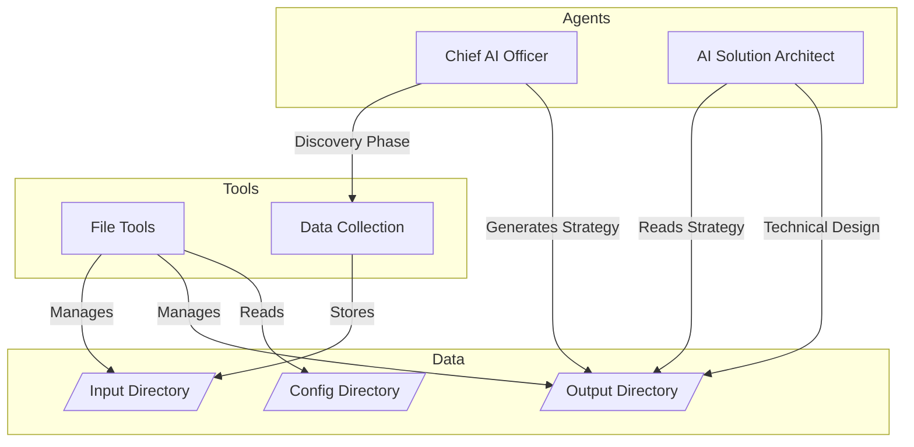

# Virtual Chief AI Officer (vCAIO) - WhiteGlove AI

An AI-powered solution architect and strategy consultant that helps organizations develop their AI transformation roadmap.

**TODO: instructor / trainer agent, engineer agent, analyst agent, project manager agent**

## Architecture



## Setup
**Clone Repo**:
```bash
git clone https://github.com/whitegloveai/vcaio-aiamf-workers.git
```
**Install UV** (if not already installed):
```bash
curl -LsSf https://astral.sh/uv/install.sh | sh
```

1. Create a client configuration in `src/config/client.yaml` with:
   - Organization details
   - Business context
   - Technical context:
     - Compliance requirements
     - Data sources
     - IT estate information
     - Current AI/ML initiatives

2. Place any supporting documents in `./data/input/`

3. Run the vCAIO:
```bash
python3 workers.py
```

4. Review outputs in `./data/output/`:
   - `organization-caio-*.md`: AI Strategy Document
   - `organization-architect-*.md`: Technical Implementation Plan

## Project Structure

```
.
├── src/
│   ├── client/         # Client context and data management
│   ├── config/         # Configuration files
│   └── agents/         # AI agent definitions
├── data/
│   ├── input/          # Client input documents
│   └── output/         # Generated strategies and plans
└── workers.py          # Main execution script
```

## Author

**Tobalo Torres-Valderas**  
Chief AI Solutions Architect  
WhiteGlove AI  
tobalo@whitegloveai.com
