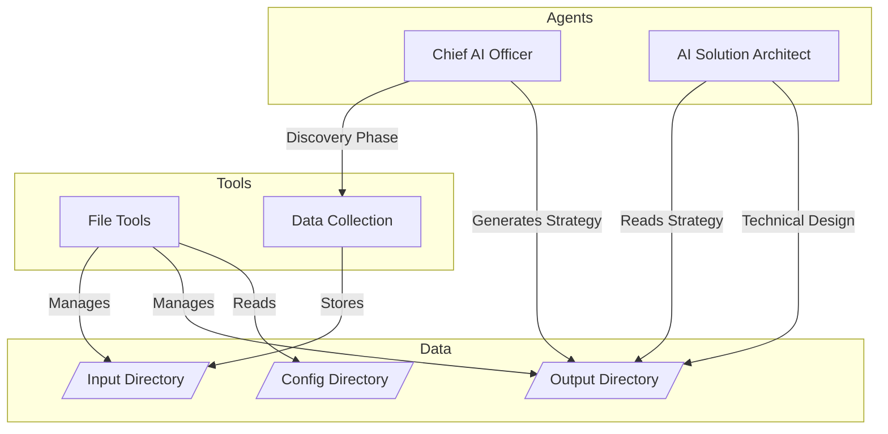

# Virtual Chief AI Officer (vCAIO) - WhiteGlove AI

An AI-powered solution architect and strategy consultant that helps organizations develop their AI transformation roadmap.

**TODO: instructor / trainer agent, engineer agent, analyst agent, project manager agent**

## Architecture



## Setup
**Clone Repo**:
```bash
git clone https://github.com/whitegloveai/vcaio-aiamf-workers.git
cd vcaio-aiamf-workers
```

**Install uv and setup venv** (if not already installed):
```bash
curl -LsSf https://astral.sh/uv/install.sh | sh
uv venv .venv
source .venv/bin/activate
uv pip install -e .
```

Setup `.env`:
```bash
cp .env.example .env # Input your OpenAI API key (we'll probably want to do local private agents in the event of security/legal concerns)
```

1. Create a client configuration in `src/config/client.yaml` with:
   - Organization details
   - Business context
   - Technical context:
     - Compliance requirements
     - Data sources
     - IT estate information
     - Current AI/ML initiativesvcaio validate-config

2. Place any supporting documents in `./data/input/`

3. Usage:
```bash
# Validate config
vcaio validate-config

# Run full workflow with default config
vcaio run

# Run with custom config and output directory
vcaio run --config ./src/config/custom-client.yaml --output-dir ./reports

# Show all available commands
vcaio --help

# Display version
vcaio --version

# List available AI agents
vcaio list-agents
```

4. Review outputs in `./data/output/`:
   - `organization-caio-*.md`: AI Strategy Document
   - `organization-architect-*.md`: Technical Implementation Plan

## Project Structure

```
.
├── src/
│   ├── agents/         # AI agent definitions
│   │   ├── caio.py     # Chief AI Officer agent
│   │   └── architect.py # Solution Architect agent
│   ├── client/         # Client context and data management
│   ├── config/         # Configuration files
│   │   └── client.yaml # Client configuration template
│   ├── services/       # Shared services and utilities
│   ├── cli.py         # Command-line interface
│   ├── config.py      # Global configuration
│   └── core.py        # Core execution logic
├── data/
│   ├── input/         # Client input documents
│   └── output/        # Generated strategies and plans
├── pyproject.toml     # Project metadata and dependencies
├── .env.example       # Environment variables template
└── README.md         # Project documentation
```